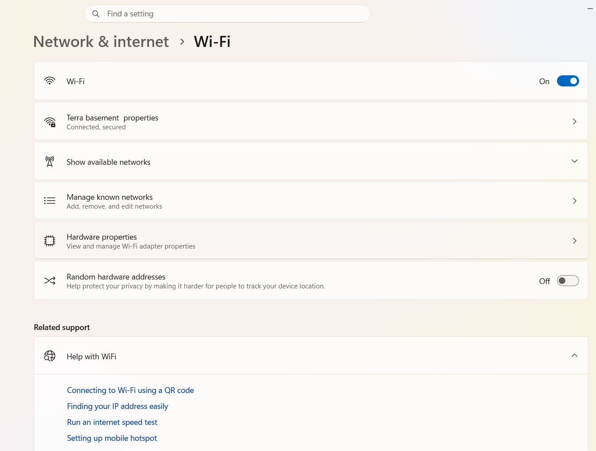
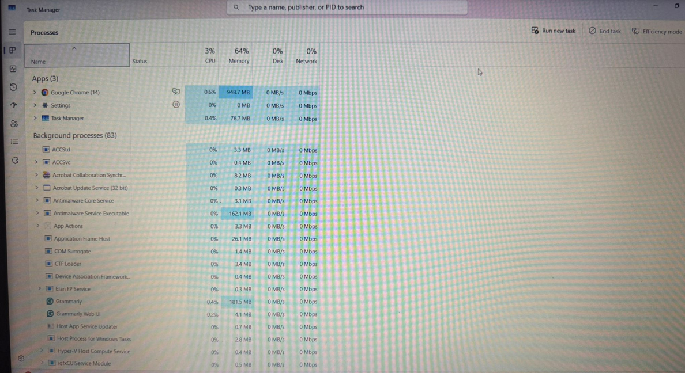
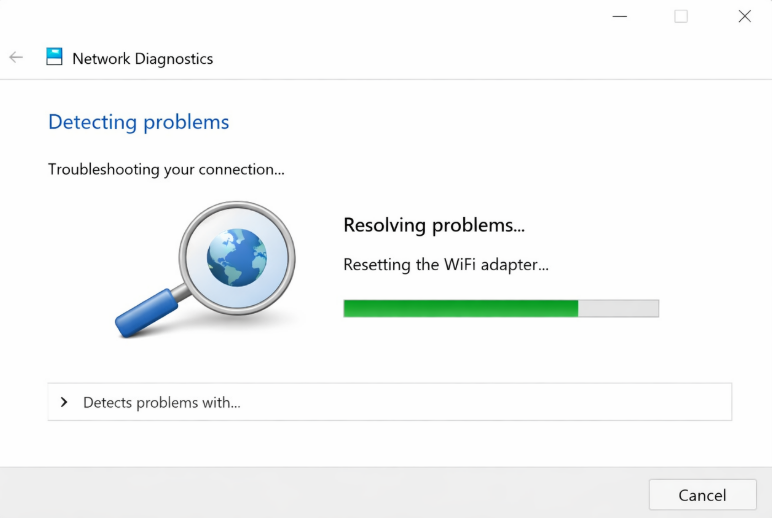
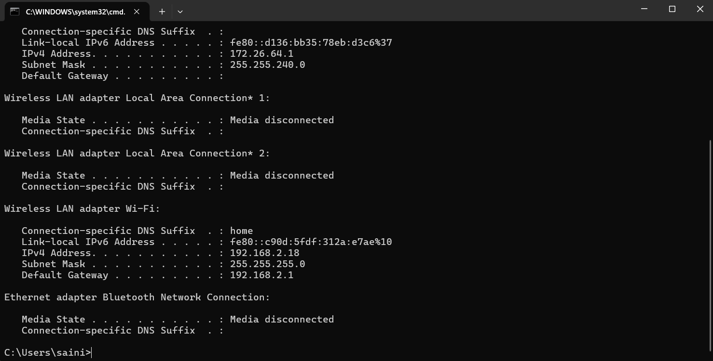

# IT Troubleshooting Guide

## About This Project
This project contains simple solutions for common computer and network problems.

## Common Issues & Fixes

### 1. WiFi Not Working
- Restart router
- Check airplane mode
- Reconnect network

### 2. Slow Computer
- Restart system
- Close background apps
- Check for updates

## Tools Used
- Windows OS
- Basic Networking
## Screenshots

### WiFi Issue Example

### Slow Computer (Task Manager)

### Network Troubleshooting

### IP Configuration

## Troubleshooting Steps Summary
1. Identify the issue  
2. Check basic settings (WiFi, cables, restart)  
3. Use built-in tools (Task Manager, Network Troubleshooter)  
4. Run commands like ipconfig  
5. Apply fix and verify  

## Skills Demonstrated
- IT Troubleshooting  
- Networking Basics  
- Problem Solving  
- Windows OS Support 
## Author
Preeti Saini
